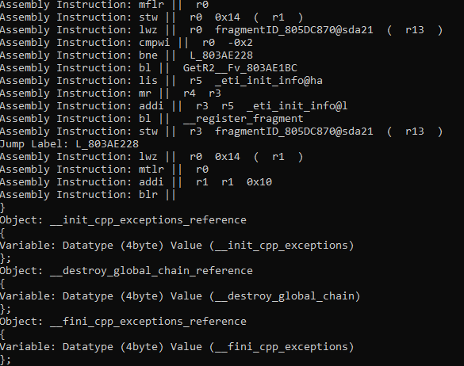

# Power PC (Game Cube) To C++
A WIP GameCube Power PC to C++ static transcompiler.

Started as a project for renaming DTK output, turned into a attempt at turning DTK outputed assembly to C++.

There are two programs `PPCC - Power PC C++ Compiler` and `Struct Rename`

# PPPC

PPCC is a four stage static transpiler

## Step 0 - Lexing


After using DTK to generate symbols and assembly. The code can then be passed into the transpiler. It goes through the file using the DTK generated macro syntax sugar as a refrence when tokenizing everything. This first stage flags where functions start and end. Where objects/structs start and end, variables and their value, jump address, instructions, alignment (unused), section (unused), and other . directives.

## Step 1 - ASM First Pass AST


Once we have a stream of tokens, we start the first pass of making a AST. This AST condenses the tokens and provides more specific bits of data.

## Step 2 - ASM Fine Grain AST

With the first pass done, we move onto taking that structure and refining it even furthur. This means functions and objects get compressed into a single Node. Variables get their internal datatype finalized and data, this means function pointers actually become function pointers and doubles/floats get their .0f needed for C++. This is also where instruction parameters are defined from loose tokens to real data.

## Step 3 - C++ First Pass AST

This step is where the Fine Grain AST starts to be turned into C++. This means objects become real structs with names for their variables and memory offets. Functions get their return type defined. And Assembly Instructions get turned into Sudo-C.

## Step 4 - C++ Fine Grain AST

This step is where the Sudo-C is finalized into Nodes and blocks of code. Jump Addesses become if else statments and code is validated

## Step 5 - C++ output

The Fine Grain C++ AST is converted to C++ code and written into a file, finishes the process.

# Struct Renaming

Struct renaming handles the process of sifting through the ASM and symbol file. Then from there renaming objects in the ASM based on their varibles inside.

## Naming Scheme

All `lbl_` objects get found and have a name generated for them and the count appended to the end.

If a object contains only .floats(s) the object will be renamed `LBL_STRUCT_FLOAT_XXX`.

If a object contains only .skip(s) the object will be renamed `LBL_STRUCT_SPACE_RESERVE_SKIP_XXX`.

If a object contains only .double(s) the object will be renamed `LBL_STRUCT_DOUBLE_XXX`.

If a object contains only .byte(s) the object will be renamed `LBL_STRUCT_BYTE_XXX`.

If a object contains only .byte4(s) the object will be renamed `LBL_STRUCT_BYTE4_XXX`.

The fallback incase a object has a mix of types or can't be deducated. The struct will be called `LBL_STRUCT_XXX`.

## Useage

In order to run StructRename.exe, it requires a few file paths.

```
-asm <path> || the directory path to the folder containing your decompiled assembly. Normally found in the build folder after DTK does it's thing.

-symbolFile <path> || The full path to the symbols.txt file where DTK outputs it's symbols.

```

Struct Rename will run and spit out in the console what objects it is renaming.